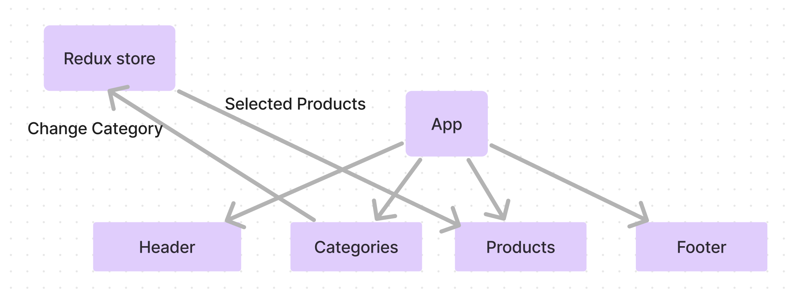

# storefront

**Author**: Brendan McMullen
**Version**: 1.0.0

## Overview
This is a basic template for a store front website with food and electronics products.
## Architecture
    "@emotion/react": "^11.11.4",
    "@emotion/styled": "^11.11.5",
    "@mui/icons-material": "^5.15.20",
    "@mui/lab": "^5.0.0-alpha.170",
    "@mui/material": "^5.15.20",
    "@redux-devtools/extension": "^3.3.0",
    "react": "^18.2.0",
    "react-dom": "^18.2.0",
    "react-redux": "^9.1.2",
    "redux": "^5.0.1",
    "sass": "^1.77.5"

## Credit and Collaborations
chatgpt

## UML Diagram

